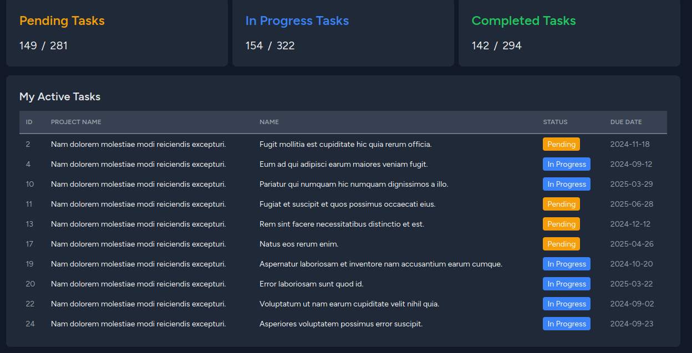

### Full Stack Project Management

Full Stack Project Management SPA with react 18, typescript, tailwindcss, inertia, Dokcer and Laravel 11

## Installation with docker

1.Clone the project

    git clone git@github.com:Moyhe/project_management.git

2.Run composer install && npm install then

Navigate into project folder using terminal and run

    docker run --rm \
    -u "$(id -u):$(id -g)" \
    -v "$(pwd):/var/www/html" \
    -w /var/www/html \
    laravelsail/php82-composer:latest \
    composer install --ignore-platform-reqs

3.Copy .env.example into .env

    cp .env.example .env

4.Start the project in detached mode

    ./vendor/bin/sail up -d

5.start vite serever

    npm run dev

From now on whenever you want to run artisan command you should do this from the container.
Access to the docker container

    ./vendor/bin/sail bash

6.Set encryption key

    php artisan key:generate --ansi

7.Run migrations

    php artisan migrate

8.to seed data

    php artisan migrate --seed

## Features

1. Registration & Login
2. Projects CRUD with sorting, filtering and pagination
3. Tasks CRUD with sorting, filtering and pagination
4. Create Tasks inside project
5. Show all tasks or show tasks for a specific project
6. Assign users to tasks
7. View Tasks assigned to me
8. Show dashboard with overview information
